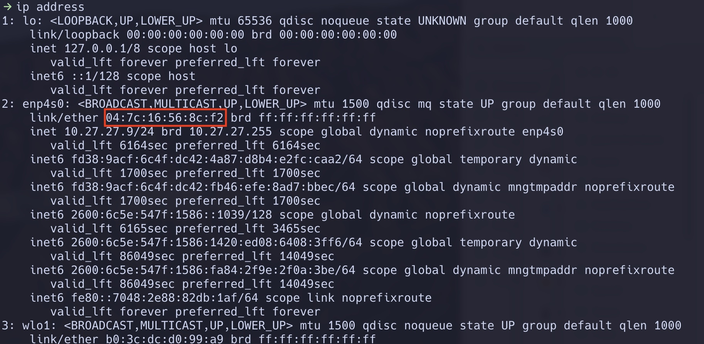

# wakeupmachine

Desktop computers typically have a power-save mode which puts them in a suspended state after a period of inactivity. This is a great feature as it helps to save power and prolongs the life of the hardware. In the case of a laptop, it helps to preserve battery life too.

Waking the machine typically involves either pressing the keys on the keyboard or moving the mouse. This is fine, but what if you are not close by and you want to wake your machine?

Fortunately, there is a way to remotely wake the machine from its slumber. The feature that enables this is called "Wake-on-LAN". Basically, a magic packet is sent to the network interface of the machine from some other machine, and if configured to do so, can trigger the machine to wake-up out of its slumber.

Why might this be useful? Well, perhaps the machine is running some kind of useful network accessible service. Rather than configure the power management of the machine to always stay on, having some kind of remote wake capability enables you to continue to get the benefits of sleep mode but without the hassle of needing to be in the vicinity of the machine if you need to access it.

This little utility provides a wake-up service that you can access from any device with a browser. Once deployed, you simply go to the URL as follows:

    http://<server>:8000/wakeup/04:7c:16:56:8c:f2

For example, I have my wakeupmachine service deployed on server 10.27.27.8. The MAC address of the machine I wish to wake is 04:7c:16:56:8c:f2. I point my browser to the following URL as follows to wake:

    http://10.27.27.8:8000/wakeup/04:7c:16:56:8c:f2

If everything works, you should see the following response in your browser and the specified machine should have woken up:

## Configure The Sleeping Machine

Wake-on-LAN is most likely turned off by default. There most likely will be a BIOS setting you will need to set to enable it.

In addition, depending on your OS, there may be extra configuration steps. When using Linux, this is most likely done using ethtool.

You can test your configuration by installing [wakeonlan](https://github.com/jpoliv/wakeonlan).

## Installation

You deploy wakeupmachine on a server, or a Raspberry PI. It just needs to be always powered on. It needs to be capable of running Docker and it needs to support Docker host networking (sorry, Docker Desktop for Mac does not work). It also needs to be on the same network as the machine that needs to be woken up. In the example below, I'm using a Linux server running Ubuntu Server.

Once you have cloned the repo, you can build the container as follows (assuming Docker has been installed):

    $ docker build . -t wakeupmachine

It can then be run as follows:

    $ docker run -d --network=host --name "wakeupmachine" --restart=unless-stopped wakeupmachine

This ensures the container will be restarted if the server is rebooted. It also ensures the container uses the host's network stack instead of creating its own isolated network namespace. This is required as it needs to be able to reach the machine that needs to be woken.

To form the wakeup URL, you will need to identify the MAC address of the network interface on the machine you will need to wake up when it is asleep. My machine is running Linux (Pop!\_OS 22.04 LTS) and so I use "ip address" on the command line:

